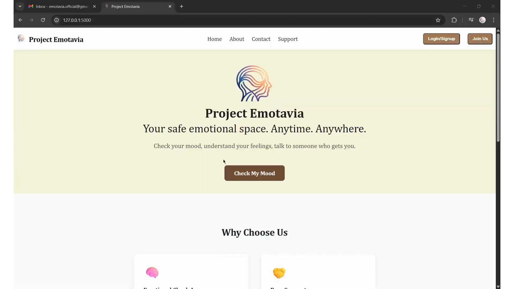

# 🧠 Emotavia - Emotional Support System

A web-based emotional wellness application designed to provide a stigma-free environment where individuals can safely express their emotions, understand their feelings, and receive actionable mental health support. It features AI-driven mood analysis, automated daily check-ins, and community-driven peer support.   

This is an MVP web application developed for BAMMC student who showcased the project at the University of Mumbai's Aavishkar Inter-Collegiate Research Convention 2025-26.

## 📖 Overview

Emotavia was born from the realization that emotional challenges do not discriminate, yet many people struggle silently due to a lack of accessible, judgment-free support. The platform bridges this gap by acting as an intelligent, 24/7 emotional companion. Users can check their mood manually or interact with an AI consultant ("Emo AI") that analyzes their recent experiences to provide tailored, empathetic advice and accurately summarize their mental state. The system also bridges the gap to human connection through demographic-matched peer support.

## ✨ Key Features

* **AI Emotional Consultant ("Emo AI"):** Integrates OpenAI's GPT-4o-mini to guide users through reflective questions, analyzing their responses to provide structured, empathetic, and actionable mental health advice.
* **Intelligent Mood Detection:** Features a dual-path mood tracking system. Users can either manually select from categorized emotions or let the AI analyze their multi-step textual reflections to accurately define their current mood.
* **Tailored Peer Support:** Automatically matches users with peer supporters based on their registered gender, language preference, and dynamically detected mood to ensure highly relevant and comfortable interactions.
* **Automated Daily Check-Ins:** Utilizes a background scheduler to automatically send personalized morning check-in emails, encouraging users to track their emotional state proactively.
* **Emotavia Circles:** Offers dedicated support communities (like Parenting Circles, Youth Circles, and Teacher Circles) to foster emotional literacy and resilience among specific demographics.
* **Secure User Authentication:** A robust user registration and login system utilizing session management and MySQL data storage.

_Note: Features like Peer Support and initiatives like Community Circles will be included during the real-time full deployment of application._

## 🛠️ Technologies

* **Frontend / GUI:** HTML, CSS, JavaScript (Jinja2 Templates), Formspree (Contact Forms)
* **Backend:** Python, Flask
* **AI Integration:** OpenAI API (`gpt-4o-mini`)
* **Database:** MySQL
* **Background Processing:** APScheduler (for automated emails)
* **Email Service:** `smtplib` via Gmail SMTP

## 📝 Prerequisites

To run this project locally, ensure that you have the following installed and configured on your machine:

* Python 3.13.7
* Microsoft VS Code (or your preferred Python IDE)
* MySQL Database Server & MySQL Workbench
* A virtual environment (recommended)
* Required Python libraries (`flask`, `python-dotenv`, `mysql-connector-python`, `apscheduler`, `openai`)
* An active OpenAI API Key, Formspree Form URL and SMTP Credentials (stored securely in a .env file).

Execute the following commands in the Terminal (PowerShell) to set up your virtual environment, obtain your flask secret key and install the required packages:

```
python -m venv .venv
```
```
.\.venv\Scripts\Activate.ps1
```
```
python -c "import secrets; print(secrets.token_hex(16))"
```
```
pip install -r requirements.txt
```

## 🎥 Project Demonstration

Click to watch the demo!
<div align="center">
  <a href="https://docs.google.com/videos/d/1mI3me8E2V2IRBOlHUXxHf1hxezMOpSr6FSIxaja0Nw0/edit?usp=drive_link">
    
  </a>
</div>
